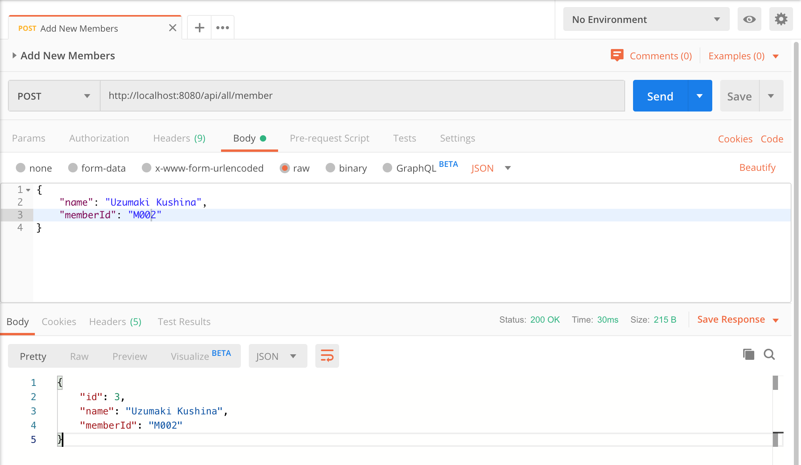
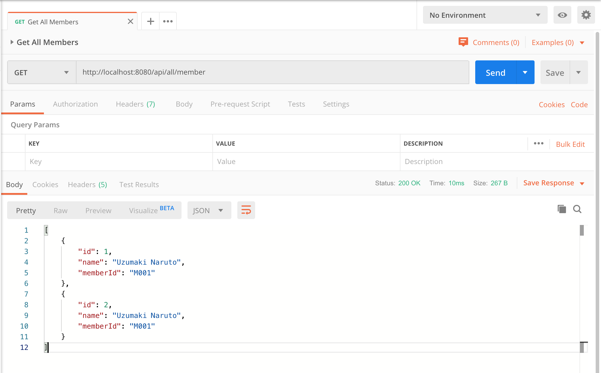
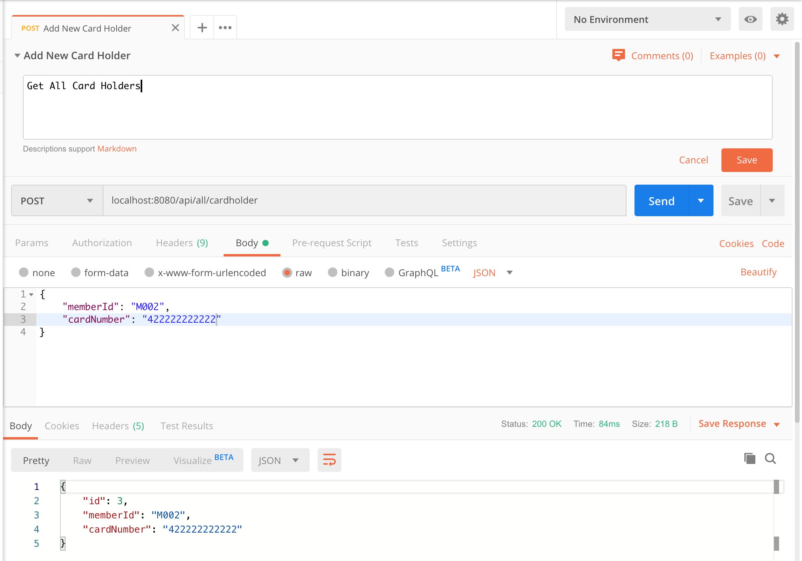
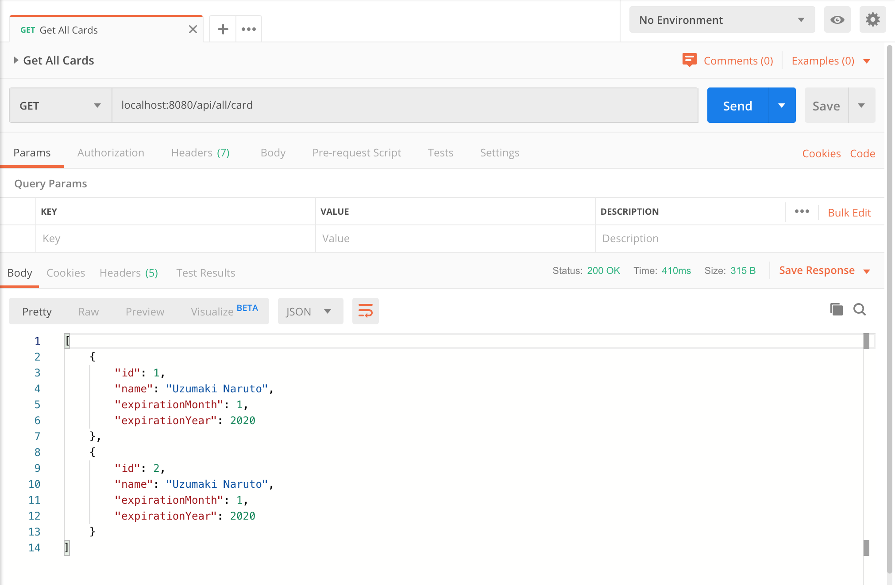
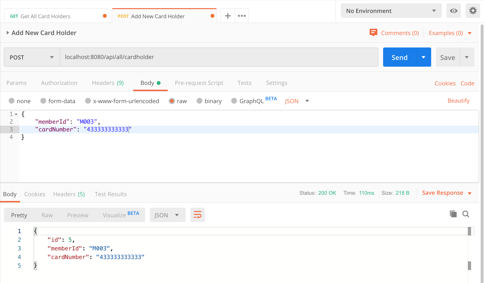
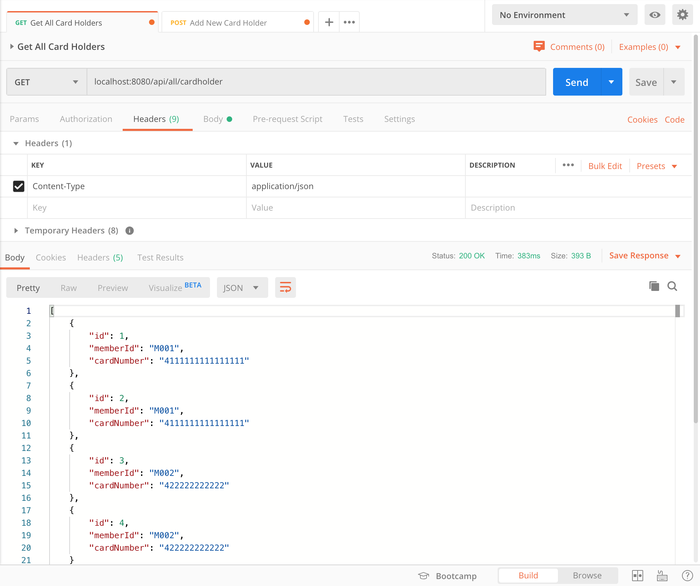

# springboot-multipledatasources

## Things to do:
1. Clone this repository: `git clone https://github.com/hendisantika/springboot-multipledatasources.git`
2. Go to the folder: `cd springboot-multipledatasources`
3. Run the application: `mvn clean spring-boot:run`
4. Open REST API Client tool such as [POSTMAN](https://www.getpostman.com/) .

## Screen shot

**Add New Member**

**Get All Members**

**Add New Card**

**Get All Cards**

**Add New Card Holder**

**Get All Card Holders**

## Conclusion
When dealing with just one datasource and Spring Boot, data source configuration is simple. Spring Boot can provide a lot of auto configuration.

However, if you need to connect to multiple datasources with Spring Boot, additional configuration is needed.

You need to provide configuration data to Spring Boot, customized for each data source.
